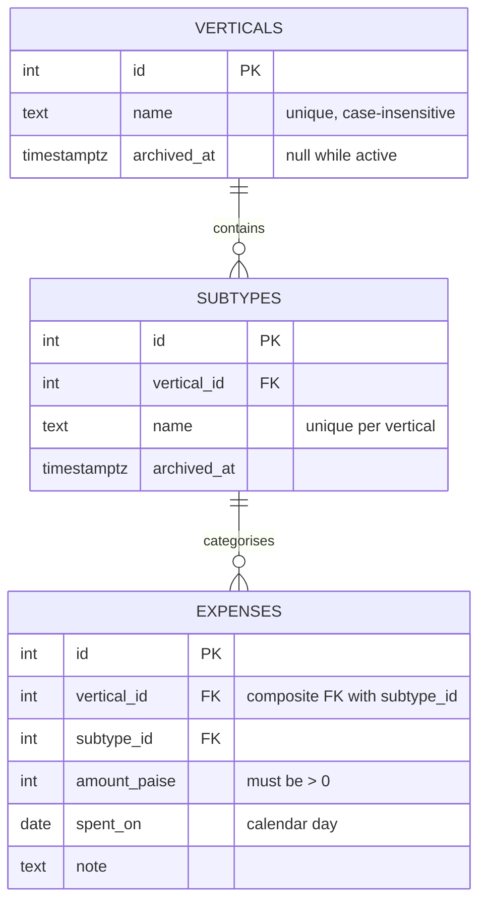

<div align="center">

# 💸 Expense Tracker

**Know where your money actually goes.**

A single-user expense tracker built for rupees — exact to the paise, categorised
two levels deep, and fast to log.

<br />

[](https://nextjs.org)
[](https://react.dev)
[](https://www.typescriptlang.org)
[](https://tailwindcss.com)

[](https://www.postgresql.org)
[](https://neon.tech)
[](https://orm.drizzle.team)
[](https://vercel.com)

<br />


</div>

---

## Why this exists

Most trackers get money wrong in small ways that compound. This one is built
around three decisions:

| Decision | Reason |
| :--- | :--- |
| 🪙 **Amounts stored as whole paise** | Floating point drifts. `0.1 + 0.2` has no business anywhere near a spend total. |
| 🔒 **Categories validated by the database** | An expense can't be filed under a category pairing that doesn't exist — enforced in Postgres, not by hope. |
| 🗓️ **Dates are days, not timestamps** | An expense logged at 12:30am IST stays on *today*, instead of sliding into yesterday's total. |

---

## Features

- 🔐 **Single-user sign-in** — one account, signed HTTP-only session cookie, no user table to leak
- 🗂️ **Two-level categories** — *verticals* (Food, Shopping) each holding *subtypes* (Groceries, Store)
- ₹ **Exact rupee handling** — type `254.2`, store `25420` paise, render `₹254.20` with proper lakh/crore grouping
- 🛡️ **Nothing deletes out from under you** — categories archive rather than disappear, and a subtype in use simply refuses to go
- 📊 **Charts** — spending broken down by category *(coming)*

---

## Data model



An expense stores **both** its vertical and its subtype, so totals per category
need no join — and a composite foreign key onto `subtypes (id, vertical_id)`
makes it impossible for the two to disagree.

---

## Quick start

```bash
npm install
cp .env.example .env.local          # fill in email, password, session secret

vercel env pull --environment=development .env.scratch
# copy the DATABASE_URL / POSTGRES_* / PG* lines into .env.local, then rm it

npm run dev
```

> [!WARNING]
> Don't run `vercel env pull` straight into `.env.local` — it overwrites the
> file, and the auth credentials currently live only in Vercel's *Production*
> environment. See [docs/environment.md](docs/environment.md).

Then open <http://localhost:3000>.

---

## Scripts

| Command | |
| :--- | :--- |
| `npm run dev` | Start the dev server |
| `npm run build` | Production build |
| `npm run lint` | ESLint |
| `npm run typecheck` | `tsc --noEmit` |
| `npm run db:generate` | Write a migration from schema changes |
| `npm run db:migrate` | Apply pending migrations |
| `npm run db:studio` | Browse the data |

> [!NOTE]
> `typecheck`, `lint`, and `build` must **all** pass before anything ships.

---

## Documentation

Full docs live in [`docs/`](docs/).

| | |
| :--- | :--- |
| 🚀 [Getting started](docs/getting-started.md) | Setup, scripts, and shipping checklist |
| 🗺️ [Project structure](docs/project-structure.md) | Where everything lives and why |
| 🧭 [Conventions](docs/conventions.md) | How data is read, written, and aggregated |
| 🗄️ [Database](docs/database.md) | Tables, constraints, indexes, migrations |
| 💰 [Money](docs/money.md) | Parsing, storing, and formatting rupees |
| 🔑 [Auth](docs/auth.md) | Sessions and where authorisation is enforced |
| 🎨 [UI](docs/ui.md) | Components, styling, fonts, dark mode |
| ⚙️ [Environment](docs/environment.md) | Every variable, and one trap worth knowing |
| ▲ [Deployment](docs/deployment.md) | Vercel, branches, previews, known gaps |

---

## Roadmap

- [x] Single-user authentication with signed sessions
- [x] Database schema — verticals, subtypes, expenses
- [x] Exact INR handling in paise
- [ ] Expense entry and editing
- [ ] Category management UI
- [ ] Calendar view with monthly, weekly, and custom ranges
- [ ] Spending charts by category

---

<div align="center">
<sub>Built with Next.js · Deployed on Vercel</sub>
</div>
