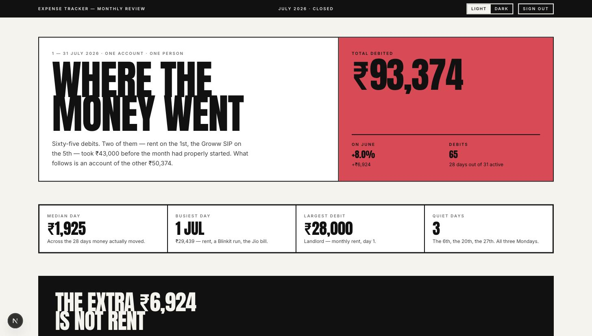
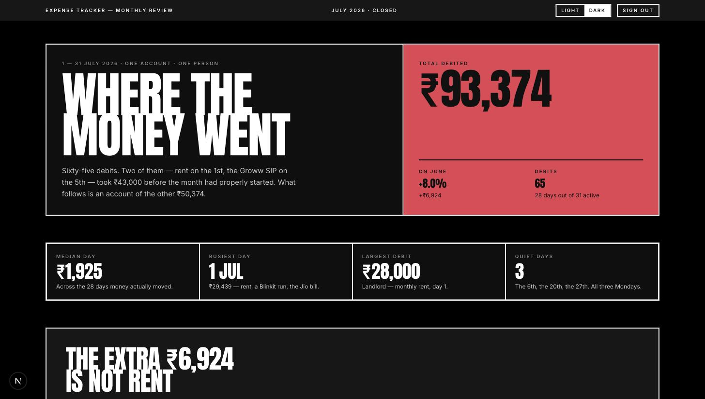
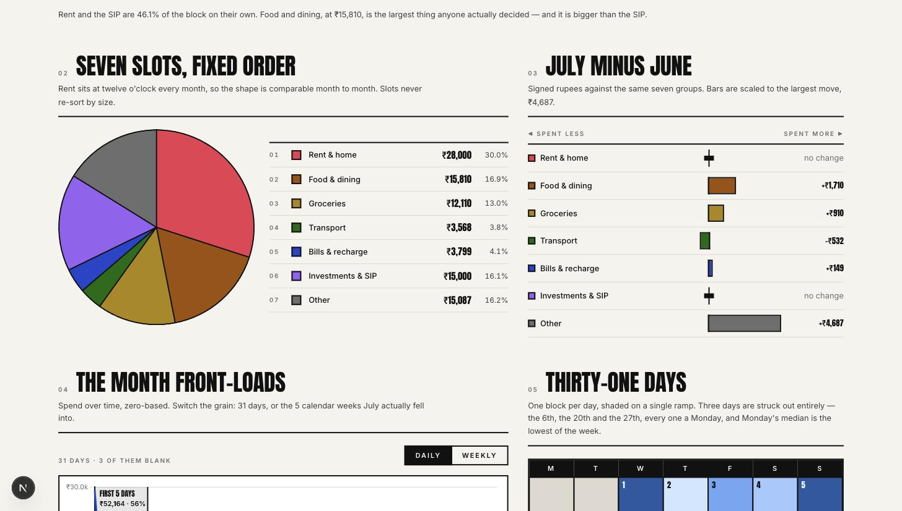
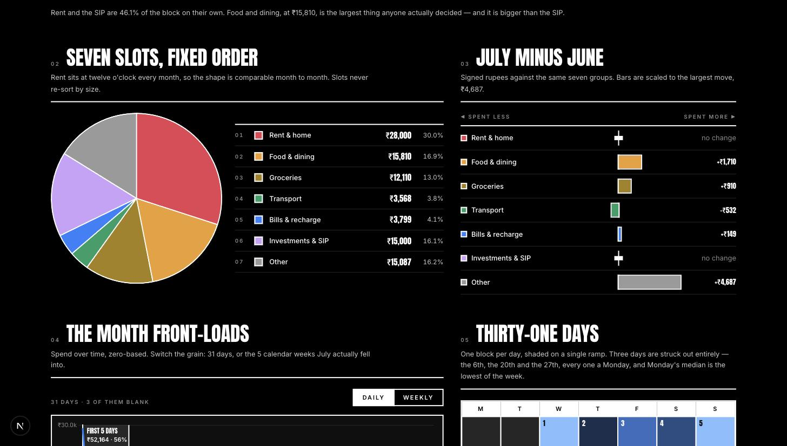

# Design system — Brutalist

The chosen direction, and the only one. Read this **before changing any styling,
colour, spacing or chart**. If a change would contradict something here, change
this document first and say why.

Everything below is enforced by `npm run palette`, which fails the build rather
than trusting a comment.

---

## 1. What the design is

A Swiss-poster reading of a bank statement. Heavy rules, flat blocks, no radius,
no shadows, no gradients. One condensed display face doing all the shouting and
one quiet grotesque doing the talking. Area and length carry the numbers; colour
only ever carries *identity*, never magnitude and never sentiment.

The page is a document you read top to bottom, not a dashboard you scan.

### Reference

| Light | Dark |
|---|---|
|  |  |
|  |  |

> These were captured during the design phase, against sample data, and are kept
> as the **visual reference for what a populated page should look like**. The app
> currently ships with no data wired, so the running page shows the same layout
> with empty states. The dark shots predate nothing — they are the true-black
> theme as shipped.

Both themes are first-class. Neither is "the real one with a filter over it" —
the ramp inverts direction, the rules invert polarity, and the categorical hexes
are a different validated set in each.

The dark theme is **true black** (`#000000`), chosen over a neutral grey and over
blue-black and warm-charcoal alternatives. Grey surfaces soften, and softening is
the one thing this design does not do.

---

## 2. Non-negotiables

These are the rules that break something real when violated.

1. **No radius, no shadow, no gradient.** `border-radius: 0` is set globally on
   form controls in `globals.css`. A rounded card is not this design.
2. **Rules are 2px and they are ink**, not a grey hairline. `--rule` is the ink
   colour, which means it flips to light on the dark theme. `border-rule`.
3. **Colour is identity only.** Slot 0 is Rent in both themes and every month.
   Never re-sort a series by value, never colour a bar by how big it is, never
   use red for "bad" — this is a spend tracker, "up" is not self-evidently bad.
4. **Every coloured series is also directly labelled.** Colour is never the only
   channel carrying a value.
5. **Bars and areas start at zero.** No broken axes, no dual axes, no log scale.
6. **Money is always `formatINR()`** from `@/lib/transactions` — en-IN lakh
   grouping and a real ₹. Never `toLocaleString()` inline, never `$`.
7. **Never hand Chart.js a CSS variable.** See §5.

---

## 3. Colour

### The two files, and why there are two

| File | Consumed by | Form |
|---|---|---|
| `src/app/globals.css` | all markup | CSS custom properties |
| `src/lib/palette.ts` | `<canvas>` only | literal hex in JS |

They duplicate every value on purpose. CSS cannot import TypeScript, and
**Chart.js v4 cannot parse `oklch()`, `color-mix()` or a `var()`** — hand it one
and it fails silently or paints black. `npm run palette` reads both files and
fails if they disagree, so the duplication cannot rot.

Markup uses the variables, so **a theme switch re-colours server-rendered HTML
with no JavaScript and no re-render**. Only the canvas needs the JS palette.

### Slots — frozen, validated, never re-ordered

| Slot | Group | Light | Dark |
|---|---|---|---|
| 0 | Rent & home | `#E93A51` | `#E54154` |
| 1 | Food & dining | `#A05001` | `#ED9E2F` |
| 2 | Groceries | `#AD8604` | `#A48118` |
| 3 | Transport | `#106B07` | `#169F65` |
| 4 | Bills & recharge | `#2145CA` | `#2981FB` |
| 5 | Investments & SIP | `#9760F2` | `#CBA1FA` |
| 6 | Other | `#6E6E6E` | `#9A9A9A` |

Slot 6 is deliberately at **zero chroma** so it reads as "not a category" rather
than as a seventh thing.

Each slot has a matching `--on-N` — the text colour measured to clear 4.5:1 on
that block. Use it; do not guess white.

### Surfaces

| Token | Light | Dark | Use |
|---|---|---|---|
| `--page` | `#F5F3ED` | `#000000` | the sheet |
| `--card` | `#FFFFFF` | `#0F0F0F` | anything inside a 2px rule |
| `--ink` | `#111111` | `#FFFFFF` | body text |
| `--ink-2` | `#3D3D3D` | `#C9C9C9` | secondary prose |
| `--muted` | `#6E6E6E` | `#8A8A8A` | micro-caps, axis ticks |
| `--grid` | `#DDD9CF` | `#262626` | chart gridlines, light row rules |
| `--rule` | `#111111` | `#FFFFFF` | every heavy border |
| `--bar` / `--on-bar` | `#111111` / `#F5F3ED` | `#171717` / `#FFFFFF` | masthead, footer, verdict block |
| `--focus` | `#3D74D9` | `#3D74D9` | the focus ring — one value, both themes |

`--focus` is deliberately **not** a categorical slot. The ring can land on any
surface, including the masthead band, which the slot checks never look at.
Reusing `--slot-4` shipped a **2.49:1** ring on the light bar; the current token
clears **≥4.01:1** on all six surfaces. Check 7 enforces it.

`--bar` stays dark in **both** themes. Flipping it would put the brightest
object on the page in the reader's eyeline. On the black theme it is *lighter*
than the page (`#171717` on `#000000`) so the band still reads as a band.

### Calendar ramp

One hue, five fixed steps, and it **reverses direction between themes** —
light→dark on the light sheet, dark→light on the dark one, so "more" is always
"further from the page". Cuts are fixed round numbers (`rampStep`), not
quantiles, because a reader can hold five round numbers. `₹0` days are not
step 0 — they are struck out with a hatch, so absence reads as absence.

### The six checks

`npm run palette` runs these against both themes and exits non-zero on failure:

| # | Check | Threshold |
|---|---|---|
| 1 | Lightness band | OKLab L within 0.22, inside the surface's band |
| 2 | Chroma floor | slots ≥ 0.075, "Other" ≤ 0.035 |
| 3a | CVD, adjacent slots | ΔE2000 ≥ 12 under protan/deutan/tritan |
| 3b | CVD, no universal collision | every pair ≥ 9 for its best-case dichromacy |
| 4 | Normal-vision floor | every pair ΔE ≥ 15 |
| 5 | Surface contrast | every slot ≥ 3:1 on page *and* card |
| 6 | Ink contrast | ink ≥ 7:1, ink-2 ≥ 4.5:1, muted ≥ 3:1 |
| 7 | Focus ring | `--focus` ≥ 3:1 on page, card **and** bar (WCAG 1.4.11) |

**Why 3 is split.** Six distinct hues cannot all be pairwise separable under full
dichromacy — green and red-orange *are* the same colour to a deuteranope, and no
amount of stepping fixes it. So the hard rule is on pairs that physically touch
(neighbouring arcs, neighbouring legend rows); the global rule only forbids a
pair being invisible to *everyone*. Direct labelling covers the rest.

> The palette that shipped in the original mockup **failed** this: orange and
> gold sat at 2.37:1 against the page, well under the 3:1 floor. The current set
> was solved for, not eyeballed.

---

## 4. Type

| Role | Face | Spec |
|---|---|---|
| Display | Anton | `font-display`, uppercase, `leading-[0.82]`, `tracking-[-0.02em]` |
| Body | Inter | `font-sans`, 13–15px, `leading-relaxed` |
| Micro-caps | Inter | 10px, `font-semibold`, `uppercase`, `tracking-[0.2em]`, `text-muted` |
| Figures | either | always `tabular-nums` in a column |

Anton was chosen over Archivo Black specifically because **it carries U+20B9**,
so ₹ never falls back to a thin system glyph mid-number. If you swap the display
face, check the rupee glyph first.

Headlines use `clamp()` and are expected to be genuinely large. Do not tame them.

---

## 5. Charts

Chart.js v4 via `react-chartjs-2`. `@/lib/chart-setup` registers the pieces —
a missing scale throws at render, a missing plugin (Filler) fails **silently**.

Five rules, each of which has already caused a bug here:

1. **Literal hex only.** From `useChartPalette()` / `PALETTES[theme]`. Never a
   CSS variable, never `getComputedStyle`.
2. **Inline plugins are captured at construction and never swapped.** A plugin
   that closes over React state freezes at whatever was on screen first. Either
   read live state off the `chart` argument (`chart.data.labels?.length`) or key
   the chart on what changed. Both patterns are in `charts.tsx`.
3. **Key every chart on the theme** — `key={theme}`. This is what makes plugin
   colours follow a theme switch. Animation is off, so the rebuild is invisible.
4. **Sizing:** `responsive: true` + `maintainAspectRatio: false` + a parent with
   a definite height + `min-h-0 min-w-0` on flex ancestors. Without `min-h-0` a
   flex child floors at content height and the canvas can never shrink.
5. **`ctx.parsed.x` / `.y` are `number | null`.** Write `?? 0`.

Every canvas needs an `aria-label` naming the series and its values, because a
canvas is otherwise invisible to a screen reader. react-chartjs-2 already puts
`role="img"` on the canvas but supplies **no accessible name**, so passing the
label is on us — without it each chart is announced as an unlabelled graphic
(WCAG 1.1.1). `ChartProps` extends `CanvasHTMLAttributes`, so the prop forwards
straight onto the element.

---

## 6. Theming

Resolution order: `data-theme` on `<html>` → `prefers-color-scheme` → light.

- `THEME_BOOTSTRAP` in `@/lib/theme` is a blocking inline script in `<head>`. It
  writes `data-theme` **only when a choice is stored**, so with nothing stored
  the CSS falls through to the OS preference.
- The dark media query is scoped `:root:not([data-theme="light"])`. That
  `:not` is what makes an explicit *light* choice stick on a dark-mode machine.
- `useTheme()` is a `useSyncExternalStore`, not `useEffect` + state, so the
  hydration pass renders the server snapshot and corrects immediately without a
  mismatch warning or a visible flash.
- `<html>` carries `suppressHydrationWarning` because the bootstrap script
  legitimately mutates it before React arrives.

---

## 7. Layout

- Page max width `1360px`, gutters `px-4 / sm:px-6 / lg:px-10`.
- Sections are a 12-column grid at `lg`, stacked below it.
- Vertical rhythm between sections: `gap-10`, `lg:gap-14`.
- Nothing may cause horizontal page scroll between 360px and 1800px, and there
  are **two** strategies for that, not one:
  - **Scroll box** — the ledger only. Its `min-w-[420px]` table sits in an
    `overflow-x-auto` container, which is `tabIndex={0}` + `role="group"`
    because a scroll container nothing can focus is unreachable by keyboard.
  - **Stay fluid** — the calendar and treemap have no scroll box. The calendar
    is a `grid-cols-7` of `aspect-square` cells; the treemap is
    percentage-positioned cells in an `aspect-ratio` frame, with a taller ratio
    swapped in below `md`. Adding a scroll box to either would defeat this.
- Grid children need `min-w-0`. A grid item defaults to `min-width: auto`, so a
  chart canvas or a wide table sets its track's floor at content width and
  pushes the whole page sideways.

---

## 8. Where things live

```
src/app/globals.css              design tokens, both themes   ← start here
src/app/layout.tsx               font vars + theme bootstrap, shell
src/app/page.tsx                 the dashboard route (auth-gated)
src/components/dashboard/        the page itself, one file per section
src/components/theme-toggle.tsx  the light/dark control
src/lib/chart-setup.ts           Chart.js registration — see §5
src/lib/fonts.ts                 the two faces — see §4
src/lib/palette.ts               the canvas mirror of the tokens
src/lib/theme.ts                 theme store + bootstrap script
src/lib/transactions.ts          data layer — currently empty, no store wired
scripts/palette-check.mjs        the validator
```

`src/lib/transactions.ts` is the seam. `TRANSACTIONS` is empty, so every
selector returns the zero case and the page renders its full scaffold with empty
states. Wiring a real source means changing that module and nothing else — keep
the exported signatures stable, because the whole page reads through them.

---

## 9. Checklist before you commit a visual change

```
npm run verify      # typecheck + lint + palette + build
```

and by eye, in **both** themes:

- [ ] no horizontal scroll at 360px
- [ ] the daily/weekly toggle re-derives labels, values *and* annotations
- [ ] every new colour came from a token, not a hex typed inline
- [ ] every new number in prose is derived from the data, not asserted
