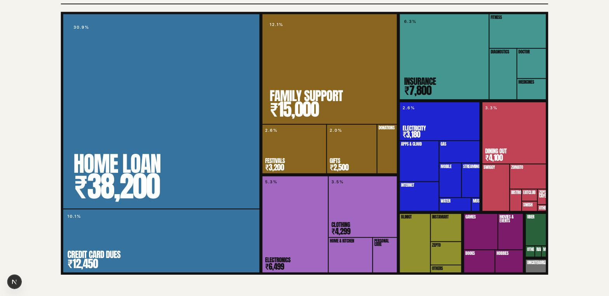
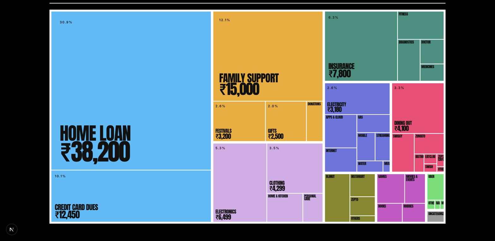

# Design system — Brutalist

The chosen direction, and the only one. Read this **before changing any styling,
colour, spacing or chart**. If a change would contradict something here, change
this document first and say why.

Everything below is enforced by `npm run palette`, which fails the build rather
than trusting a comment.

---

## 1. What the design is

A Swiss-poster reading of a bank statement. Heavy rules, flat blocks, no radius,
no shadows, no gradients. One condensed display face doing all the shouting and
one quiet grotesque doing the talking. Area and length carry the numbers; colour
only ever carries *identity*, never magnitude and never sentiment.

The page is a document you read top to bottom, not a dashboard you scan.

### Reference

| Light | Dark |
|---|---|
|  |  |
|  |  |
|  |  |

> Captured against temporary sample data, then reverted, and kept as the
> **visual reference for what a populated page should look like**. The app ships
> with no data wired, so the running page shows this same layout in its empty
> states.
>
> They are re-shot whenever the palette or the taxonomy changes — the set above
> is the ten-vertical palette, and any screenshot showing seven slots or the
> words "Rent & home" is stale and should be replaced, not trusted.

Both themes are first-class. Neither is "the real one with a filter over it" —
the ramp inverts direction, the rules invert polarity, and the categorical hexes
are a different validated set in each.

The dark theme is **true black** (`#000000`), chosen over a neutral grey and over
blue-black and warm-charcoal alternatives. Grey surfaces soften, and softening is
the one thing this design does not do.

---

## 2. Non-negotiables

These are the rules that break something real when violated.

1. **No radius, no shadow, no gradient.** `border-radius: 0` is set globally on
   form controls in `globals.css`. A rounded card is not this design.
2. **Rules are 2px and they are ink**, not a grey hairline. `--rule` is the ink
   colour, which means it flips to light on the dark theme. `border-rule`.
3. **Colour is identity only.** Slot 0 is Food in both themes and every month.
   Never re-sort a series by value, never colour a bar by how big it is, never
   use red for "bad" — this is a spend tracker, "up" is not self-evidently bad.
4. **Every coloured series is also directly labelled.** Colour is never the only
   channel carrying a value.
5. **Bars and areas start at zero.** No broken axes, no dual axes, no log scale.
6. **Money is always `formatPaise()`** from `@/lib/money` — en-IN lakh grouping
   and a real ₹. Never `toLocaleString()` inline, never `$`. Every amount the
   page handles is an integer number of **paise**; rupees only ever exist as the
   string a formatter returns. `formatPaiseCompact()` is for axis ticks and
   calendar cells, never a headline. See [money.md](money.md).
7. **Never hand Chart.js a CSS variable.** See §5.

---

## 3. Colour

### The two files, and why there are two

| File | Consumed by | Form |
|---|---|---|
| `src/app/globals.css` | all markup | CSS custom properties |
| `src/lib/palette.ts` | `<canvas>` only | literal hex in JS |

They duplicate every value on purpose. CSS cannot import TypeScript, and
**Chart.js v4 cannot parse `oklch()`, `color-mix()` or a `var()`** — hand it one
and it fails silently or paints black. `npm run palette` reads both files and
fails if they disagree, so the duplication cannot rot.

Markup uses the variables, so **a theme switch re-colours server-rendered HTML
with no JavaScript and no re-render**. Only the canvas needs the JS palette.

### Slots — frozen, validated, never re-ordered

**One slot per vertical.** Slot N is `VERTICAL_ORDER[N]` in
[`src/lib/taxonomy.ts`](../src/lib/taxonomy.ts), which mirrors the seeded
taxonomy in [database.md](database.md). The two orders must not drift.

| Slot | Vertical | Hue | Light | Dark |
|---|---|---|---|---|
| 0 | Food | red | `#CF3651` | `#FC3F75` |
| 1 | Convenience | gold | `#909000` | `#87871B` |
| 2 | Subscriptions | indigo | `#1B24D8` | `#6C75E1` |
| 3 | Transport | green | `#006336` | `#51E16C` |
| 4 | Health | teal | `#009990` | `#2D907E` |
| 5 | Shopping | violet | `#AB63C6` | `#D8ABEA` |
| 6 | Leisure | magenta | `#87096C` | `#CF51C6` |
| 7 | People | ochre | `#906300` | `#F3AB1B` |
| 8 | Loans | sky | `#1275A2` | `#36BDFC` |
| 9 | Other | grey | `#6E6E6E` | `#9A9A9A` |

Slot 9 is deliberately at **zero chroma** so it reads as "not a category" rather
than as a tenth thing. It is last, not ninth as in the seed migration, because
the achromatic slot has to sit at the end for the adjacency check to mean what
it says.

**A slot keeps its hue across themes.** The dark value is a brighter sibling of
the light one, never a different colour — Transport is the green one whichever
theme you are in. Two independently-solved palettes would each pass every check
and still destroy identity the moment someone hit the toggle.

Each slot has a matching `--on-N` — the text colour measured to clear 4.5:1 on
that block. Use it; do not guess white. On the light theme it is genuinely
mixed: five slots take white ink and five take near-black. Check 8 enforces it.

> **Nine chromatic slots was not a free upgrade from six.** The set above was
> solved for against all eight checks simultaneously, in both themes, with the
> hues pinned in pairs. It passes at full strength — no threshold was relaxed to
> make room for the extra verticals — but the light theme's worst adjacent pair
> clears deuteranopia by **ΔE 12.1 against a floor of 12**. There is almost no
> headroom left. Adding an eleventh vertical means re-solving the whole set, not
> appending a colour to the end.

### Surfaces

| Token | Light | Dark | Use |
|---|---|---|---|
| `--page` | `#F5F3ED` | `#000000` | the sheet |
| `--card` | `#FFFFFF` | `#0F0F0F` | anything inside a 2px rule |
| `--ink` | `#111111` | `#FFFFFF` | body text |
| `--ink-2` | `#3D3D3D` | `#C9C9C9` | secondary prose |
| `--muted` | `#6E6E6E` | `#8A8A8A` | micro-caps, axis ticks |
| `--grid` | `#DDD9CF` | `#262626` | chart gridlines, light row rules |
| `--rule` | `#111111` | `#FFFFFF` | every heavy border |
| `--bar` / `--on-bar` | `#111111` / `#F5F3ED` | `#171717` / `#FFFFFF` | masthead, footer, verdict block |
| `--focus` | `#3D74D9` | `#3D74D9` | the focus ring — one value, both themes |

`--focus` is deliberately **not** a categorical slot. The ring can land on any
surface, including the masthead band, which the slot checks never look at.
Reusing `--slot-4` shipped a **2.49:1** ring on the light bar; the current token
clears **≥4.01:1** on all six surfaces. Check 7 enforces it.

`--bar` stays dark in **both** themes. Flipping it would put the brightest
object on the page in the reader's eyeline. On the black theme it is *lighter*
than the page (`#171717` on `#000000`) so the band still reads as a band.

### Calendar ramp

One hue, five fixed steps, and it **reverses direction between themes** —
light→dark on the light sheet, dark→light on the dark one, so "more" is always
"further from the page". Cuts are fixed round numbers (`rampStep`, which takes
paise like everything else), not quantiles, because a reader can hold five round
numbers. `₹0` days are not step 0 — they are struck out with a hatch, so absence
reads as absence.

The cuts are in **paise**, so ₹1k is `1_00_000`. `RAMP_LABELS` prints the same
five bands in rupees for the key, and the two lists have to be edited together —
a key that disagrees with the shading is worse than no key.

The ramp is also what the **spend-over-time line** is drawn in (`ramp[4]`), not a
categorical slot. That series is total spend and belongs to no vertical, so a
slot hue would tell a reader who has just learned "sky blue is Loans" that the
line is about Loans. Both views encode magnitude, so both use the ramp family.

### The treemap's smallest cells

Two defences against a clipped figure, because `overflow-hidden` slicing through
digits turns `₹1,340.08` into a readable-but-wrong `₹1,340.0`.

The `sm` tier and the whole narrow layout **abbreviate** with
`formatPaiseCompact`, keeping the exact amount in each cell's `title`. Below
**2% of the month** an `xs` tier drops the amount entirely and carries the name
only: the taxonomy has 47 subtypes rather than 10 categories, so a cell that
small cannot hold even an abbreviated number. The figure is still in the
tooltip, the vertical table and the ledger.

### The eight checks

`npm run palette` runs these against both themes and exits non-zero on failure:

| # | Check | Threshold |
|---|---|---|
| 1 | Lightness band | OKLab L within 0.22, inside the surface's band |
| 2 | Chroma floor | slots ≥ 0.075, "Other" ≤ 0.035 |
| 3a | CVD, adjacent slots | ΔE2000 ≥ 12 under protan/deutan/tritan |
| 3b | CVD, no universal collision | every pair ≥ 9 for its best-case dichromacy |
| 4 | Normal-vision floor | every pair ΔE ≥ 15 |
| 5 | Surface contrast | every slot ≥ 3:1 on page *and* card |
| 6 | Ink contrast | ink ≥ 7:1, ink-2 ≥ 4.5:1, muted ≥ 3:1 |
| 7 | Focus ring | `--focus` ≥ 3:1 on page, card **and** bar (WCAG 1.4.11) |
| 8 | Label contrast | every `--on-N` ≥ 4.5:1 on its own slot |

The slot **count is read from `globals.css`**, not hardcoded, so adding a
vertical cannot leave its colour silently unchecked. The last slot is treated as
"Other" and the rest as the categorical set.

**Why 3 is split.** Distinct hues cannot all be pairwise separable under full
dichromacy — green and red-orange *are* the same colour to a deuteranope, and no
amount of stepping fixes it. So the hard rule is on pairs that physically touch
(neighbouring arcs, neighbouring legend rows); the global rule only forbids a
pair being invisible to *everyone*. Direct labelling covers the rest, which is
why every chart here also ships a table or a labelled axis.

**Why 8 exists.** The treemap paints a subtype name and an amount straight onto
a coloured block, so each slot needs an ink that is readable *on that slot*.
Checks 1–7 never look at that pair. With ten slots and a mixed light/dark ink
split, eyeballing it stopped being realistic.

> The palette that shipped in the original mockup **failed** this: orange and
> gold sat at 2.37:1 against the page, well under the 3:1 floor. The current set
> was solved for, not eyeballed.

---

## 4. Type

| Role | Face | Spec |
|---|---|---|
| Display | Anton | `font-display`, uppercase, `leading-[0.82]`, `tracking-[-0.02em]` |
| Body | Inter | `font-sans`, `text-note`–`text-lede`, `leading-relaxed` |
| Micro-caps | Inter | `text-micro`, `font-semibold`, `uppercase`, `tracking-[0.2em]`, `text-muted` |
| Figures | either | always `tabular-nums` in a column |

Anton was chosen over Archivo Black specifically because **it carries U+20B9**,
so ₹ never falls back to a thin system glyph mid-number. If you swap the display
face, check the rupee glyph first.

Headlines use `clamp()` and are expected to be genuinely large. Do not tame them.

### The scale

Declared once in `globals.css`, used as `text-*` utilities. **There are no
`px` type sizes anywhere in `src/`** — a `px` size ignores the reader's browser
font setting outright, so a reader who asks for larger text gets nothing.

| Token | Size | Used for |
|---|---|---|
| `text-micro` | 0.625rem | micro-caps — the label voice |
| `text-tick` | 0.6875rem | axis ticks, dense rows |
| `text-meta` | 0.75rem | secondary metadata |
| `text-note` | 0.8125rem | notes, table body |
| `text-body` | 0.875rem | body copy |
| `text-lede` | 0.9375rem | body copy, wide measure |
| `text-figure` | 1.375rem | a small figure |

### The fluid steps, and why they are `cqi` and not `vw`

| Token | Sizes against |
|---|---|
| `text-masthead` | the masthead cell |
| `text-total` | the "Total debited" block |
| `text-section` | a section head's column |
| `text-statement` | the full-bleed statement band |
| `text-signin` | the sign-in card |
| `text-cell-head` / `text-cell-day` / `text-cell-figure` | the calendar grid |

`cqi` is 1% of the **container's** inline size. `vw` is 1% of the viewport, and
for this layout those are barely related: a headline sits in a column that is a
fixed *fraction* of the page, so at 1024px the total's column is 329px while
`11vw` still reads 112px. That is how a figure ends up wider than the block it
lives in — which it did, until these tokens replaced the `vw` clamps.

**Every one of these requires an ancestor with `@container`.** Without one the
unit falls back to the small viewport, which is just the old behaviour: degraded,
not broken. The containers are on the masthead cells, each section head, the
statement band, the sign-in card, both calendar grids, and the treemap frame.

`--text-total` is the one whose coefficient is derived rather than chosen — see
the note beside it in `globals.css`. Raising it makes large amounts overflow.

---

## 5. Charts

Chart.js v4 via `react-chartjs-2`. `@/lib/chart-setup` registers the pieces —
a missing scale throws at render, a missing plugin (Filler) fails **silently**.

Five rules, each of which has already caused a bug here:

1. **Literal hex only.** From `useChartPalette()` / `PALETTES[theme]`. Never a
   CSS variable, never `getComputedStyle`.
2. **Inline plugins are captured at construction and never swapped.** A plugin
   that closes over React state freezes at whatever was on screen first. Either
   read live state off the `chart` argument (`chart.data.labels?.length`) or key
   the chart on what changed. Both patterns are in `charts.tsx`.
3. **Key every chart on the theme** — `key={theme}`. This is what makes plugin
   colours follow a theme switch. Animation is off, so the rebuild is invisible.
4. **Sizing:** `responsive: true` + `maintainAspectRatio: false` + a parent with
   a definite height + `min-h-0 min-w-0` on flex ancestors. Without `min-h-0` a
   flex child floors at content height and the canvas can never shrink. That
   definite height comes from an `aspect-*` class on the frame, not a fixed
   height — see §7 Units.
5. **`ctx.parsed.x` / `.y` are `number | null`.** Write `?? 0`.

Every canvas needs an `aria-label` naming the series and its values, because a
canvas is otherwise invisible to a screen reader. react-chartjs-2 already puts
`role="img"` on the canvas but supplies **no accessible name**, so passing the
label is on us — without it each chart is announced as an unlabelled graphic
(WCAG 1.1.1). `ChartProps` extends `CanvasHTMLAttributes`, so the prop forwards
straight onto the element.

---

## 6. Theming

Resolution order: `data-theme` on `<html>` → `prefers-color-scheme` → light.

- `THEME_BOOTSTRAP` in `@/lib/theme` is a blocking inline script in `<head>`. It
  writes `data-theme` **only when a choice is stored**, so with nothing stored
  the CSS falls through to the OS preference.
- The dark media query is scoped `:root:not([data-theme="light"])`. That
  `:not` is what makes an explicit *light* choice stick on a dark-mode machine.
- `useTheme()` is a `useSyncExternalStore`, not `useEffect` + state, so the
  hydration pass renders the server snapshot and corrects immediately without a
  mismatch warning or a visible flash.
- `<html>` carries `suppressHydrationWarning` because the bootstrap script
  legitimately mutates it before React arrives.

---

## 7. Layout

- Page max width `85rem`, gutters `px-4 / sm:px-6 / lg:px-10`.
- Sections are a 12-column grid at `lg`, stacked below it.
- Vertical rhythm between sections: `gap-10`, `lg:gap-14`.
- Nothing may cause horizontal page scroll between 360px and 1800px, and there
  are **two** strategies for that, not one:
  - **Scroll box** — the ledger only. Its `min-w-[26.25rem]` table sits in an
    `overflow-x-auto` container, which is `tabIndex={0}` + `role="group"`
    because a scroll container nothing can focus is unreachable by keyboard.
  - **Stay fluid** — the calendar and treemap have no scroll box. The calendar
    is a `grid-cols-7` of `aspect-square` cells; the treemap is
    percentage-positioned cells in an `aspect-ratio` frame, with a taller ratio
    swapped in below `md`. Adding a scroll box to either would defeat this.

    That swap stays at `md` and not later: the portrait ratio is 0.78, so at a
    1023px viewport it would stand 1250px tall. Slivers too narrow to label
    keep their name and drop the amount and the share badge, each sized from
    its own cell (`xsLabelSize`) — the ratio is not what fixes them.
- Grid children need `min-w-0`. A grid item defaults to `min-width: auto`, so a
  chart canvas or a wide table sets its track's floor at content width and
  pushes the whole page sideways.

### Units

A size is written in the unit that describes what it actually depends on:

| Depends on | Unit | Examples |
|---|---|---|
| the reader's font setting | `rem` | every type size, the ledger's `min-w`, the pie's cap |
| the box it sits in | `cqi`, `%`, `fr` | the fluid type steps, treemap cell type and padding |
| its own width | `aspect-*` | every plot frame, calendar cells, the treemap |
| nothing — it is a drawn line | `px` | the 2px rules, the treemap's 6px gutters, hatch stripes |

That last row is the only place `px` belongs. A 2px rule is 2px because it is a
rule; making it `rem` would give it a fractional width and a soft edge.

**Plot frames carry an aspect ratio between a `min-h` floor and a `max-h`
ceiling, never a fixed height.** Chart.js needs a parent with a definite height
(§5.4), and a ratio gives it one derived from the width, so a plot reflows
continuously with its column instead of stepping at a breakpoint. `LINE_FRAME`
and `BAR_FRAME` are the two shapes, and they live in their own module,
`src/components/dashboard/frames.ts` — **not** in `charts.tsx`, because
`charts.tsx` imports `EmptyPlot` from `empty.tsx`, so `empty.tsx` cannot import
back. The same string written out in both files is how a `max-h` came to exist
in one copy and not the other, and an empty plot stood 548px tall beside a
420px chart.

Both bounds are load-bearing, and both are rem so they track the type they have
to stay legible against. The **floor** exists because these columns get narrower
at `lg`, not wider: the 12-column grid takes over, so the line plot's column
falls from 720px at a 768px viewport to 537px at 1024px, and a pure ratio would
squash a time series to 244px exactly where the page has most room. The
**ceiling** stops the opposite — at the wide end of the `sm` band a bare ratio
reaches 650px. The ratio governs between them.

**A canvas has no CSS**, so `charts.tsx` does the same arithmetic by hand: tick
and tooltip sizes come from `remPx()`, and the bar annotation measures its own
widest figure and reserves exactly that, capped at `VALUE_GUTTER_MAX` of the
plot. Neither constant works alone. A fixed pixel reserve is too small once a
figure carries paise; a fixed *share* is right at one width only, and strands a
quarter of a full-bleed plot behind a figure that stopped growing at its rem
ceiling. `layout.padding` and the `barValues` plugin call the same function, so
the space reserved and the space drawn into cannot drift apart.

---

## 8. Where things live

```
src/app/globals.css              design tokens, both themes   ← start here
src/app/layout.tsx               font vars + theme bootstrap, shell
src/app/page.tsx                 the dashboard route (auth-gated)
src/components/dashboard/        the page itself, one file per section
src/components/theme-toggle.tsx  the light/dark control
src/lib/chart-setup.ts           Chart.js registration — see §5
src/lib/fonts.ts                 the two faces — see §4
src/lib/money.ts                 paise → rupee formatting — see §2 rule 6
src/lib/palette.ts               the canvas mirror of the tokens
src/lib/taxonomy.ts              the ten verticals and their subtypes
src/lib/money.ts                 paise: parse, format, compact
src/lib/theme.ts                 theme store + bootstrap script
src/lib/expenses.ts              data layer — currently empty, no store wired
scripts/palette-check.mjs        the validator
```

`src/lib/expenses.ts` is the seam. `EXPENSES` is empty, so every selector
returns the zero case and the page renders its full scaffold with empty states.
Wiring a real source means changing that module and nothing else — keep the
exported signatures stable, because the whole page reads through them. Its
shapes already match `src/db/schema.ts`: integer paise, and both a vertical and
a subtype on every row.

`src/lib/taxonomy.ts` mirrors `drizzle/0001_seed_taxonomy.sql`. The migration is
the authority; if they disagree, the migration is right. A subtype is always a
`(vertical, name)` pair, never a bare string — `Others` exists under Food,
Convenience *and* Transport, so a bare name silently merges three different
things.

It holds paise, matching the `expenses.amount_paise` column it will eventually
read from, so wiring the database up is a change of source and not a change of
unit. It does no formatting at all: that belongs to `src/lib/money.ts`.

---

## 9. Checklist before you commit a visual change

```
npm run verify      # typecheck + lint + palette + build
```

and by eye, in **both** themes:

- [ ] no horizontal scroll at 360px
- [ ] the daily/weekly toggle re-derives labels, values *and* annotations
- [ ] every new colour came from a token, not a hex typed inline
- [ ] every new number in prose is derived from the data, not asserted
- [ ] no `px` size that is not a drawn line — see §7 Units
- [ ] nothing clips at the *narrow* end of its own band. A figure that fits at
      1360px can still overflow at 1024px, because the column is a fraction of
      the page while a `vw` or fixed size is not
